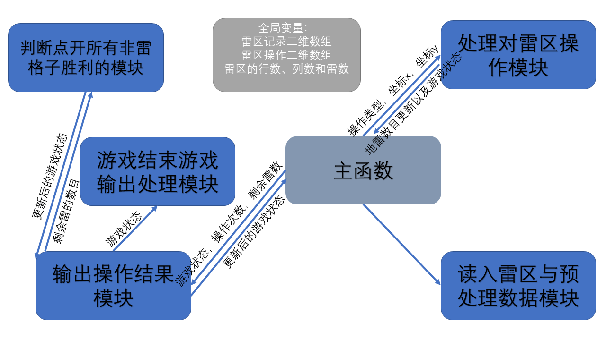

# 概要设计报告（OJ版本）

## 对于扫雷程序需求的概述

### 问题概述

在一定大小的矩阵中随机布置一定量的地雷，由玩家逐个翻开格子，以找出所有地雷为最终游戏目标。如果玩家翻开的格子有地雷，则游戏失败。如果玩家翻开所有没有地雷的格子，则游戏胜利

### 程序需求

1. 使用一定大小的字符型二维数组记录输入的雷区数据。同时使用另一个等大的二维数组记录操作结果以及最终输出
   对于输入，无雷区记为`'.'`，雷区记为`'*'`。输出有周围雷数目的数字，标记雷`'!'`等
2. 需要使用两个变量统计扫雷中的操作次数和剩余地雷数量。涉及玩家操作时需要对其及时更新
3. 玩家的对应的四种操作模式对于该二维数组的操作情况
   - 左键单击：触雷、未触雷（若周围雷区为零则进行递归打开）
   - 右键单击标记地雷
   - 右键单击标记问题
   - 右键单击取消标记
   - 双击：判断地雷是否标记完全；数字周围是否有标错的地雷。无误则调用操作1函数打开周围未标记方块

## 输入、输出设计

### 输入设计

1. 读入游戏等级设定。若为自定义则继续读入扫雷游戏行数、列数和雷数
2. 使用双层for循环读入原始雷区数据二维数组

### 输出设计

1. 函数获得调用的状态变量。分别对应三种游戏状态（继续、触雷、胜利）与游戏提示的输出
2. 输出扫雷中的操作次数和剩余地雷数量
3. 用双层for循环输出二维数组

## 算法设计

- 使用模拟操作的思路，对于给出的任何操作，对于雷区的二维数组进行对应操作。
- 需要判断时，采用遍历的思路，使用双层for循环遍历需要查找的二维区域
- 为了减少运算量，对于每个格子周围雷的数量，单独使用预处理的雷区二维数组进行记录

## 高层数据结构定义

### 全局常量定义

1. 游戏状态常量
   - CONTINUE 1 表示游戏状态的未触雷且游戏未胜利
   - BOOM 2 表示游戏状态的点开有雷的格子
   - WIN 3 表示游戏状态的胜利 / 点开了所有没有雷的格子

### 全局数据结构定义

1. 雷区记录二维数组（原始数据、预处理数据）
   字符型二维数组，记录了原始输入的雷区数据，以及经过预处理后的雷区数据（显示了各方块周围雷的数量）
2. 雷区操作二维数组
   原始按照行、列数据填充`'.'`，记录操作后应该输出的雷区情况（点开的方格以及周围雷的数量、标记的地雷以及问题区域的情况）
3. 雷区的行数、列数和雷数

注释：因为以上数据在各步骤均需要处理，为减少函数调用过程中的参数数量，因此将其使用全局变量定义

## 系统模块划分

1. 主函数
   - 输入：无
   - 处理逻辑：
     - 读入游戏等级设定。若为自定义则继续读入扫雷游戏行数、列数和雷数。使用全局变量存储该局游戏行数、列数和雷数
     - 循环读取操作类型以及坐标xy，并根据该值调用`处理对雷区操作模块`。如果标准输入流结束则终止程序
     - 记录`处理对雷区操作模块`的返回值，判断该操作后地雷数目更新以及游戏状态。如果游戏胜利则终止程序
     - 运算处理已经进行的操作次数，剩余地雷数量，并根据该值以及游戏状态调用`输出操作结果模块`。获得返回值判断是否胜利
   - 返回值：无
2. 读入雷区与预处理数据模块
   - 输入：无
   - 处理逻辑：
      - 读入原始雷区数据二维数组，使用全局变量存储
      - 读取原始雷区数据二维数组，并在每一格数据中：若为雷，则使预处理雷区二维数组对应格记录为雷；若不为雷，则循环查找周围8格雷区，记录周围雷的数量，并存储在预处理雷区二维数组对应格，使用全局变量存储
   - 返回值：无
3. 输出操作结果模块
   - 输入：游戏状态，已经进行的操作次数，剩余地雷数量
   - 处理逻辑：
      - 若游戏状态为`CONTINUE`， 调取`判断点开所有非雷格子胜利的模块`判断是否胜利，并用其返回值更新游戏状态
      - 对应三种游戏状态常量，输出不同的游戏提示
      - 输出操作次数和剩余地雷数量
      - 根据游戏状态调用`游戏结束游戏输出处理模块`
      - 输出最终的雷区情况
   - 返回值：更新后的游戏状态（判断是否胜利终止程序）
4. 处理对雷区操作模块
   - 输入：操作类型，坐标x，坐标y
   - 处理逻辑：
     - 左键单击
       - 若输出格已打开，不做处理返回
       - 若超过该游戏雷区区域，不做处理返回
       - 若对应坐标下为地雷，则返回触雷
       - 若对于坐标下没有地雷。读取预处理的雷区二维数组，若周围雷数目为`0`则递归打开周围8个方块（内调用该函数），不为`0`则直接赋值输出雷区该格为周围雷数目
     - 右键单击标记地雷
       - 判断该位置为未被打开的格子或问题标记的格子，赋值输出雷区该格标记为地雷`'!'`，返回地雷数目+1
     - 右键单击标记问题
       - 判断该位置为未被打开的格子或地雷标记的格子，赋值输出雷区该格标记为问题`'?'`。若原为地雷标记则返回地雷数目-1
     - 右键单击取消标记
       - 判断该位置为问题标记或地雷标记的格子，赋值输出雷区该格标记为未打开`'.'`。若原为地雷标记则返回地雷数目-1
     - 双击
       - 循环遍历周围雷数目，并与该格记录的周围雷数目比较。当双击位置周围已标记雷数等于该位置数字时操作有效，地雷未标记完全时使用双击无效
       - 若数字周围有标错的地雷，返回触雷操作
       - 若无误，对该数字周围未标记且未打开的格子均进行一次左键单击操作
   - 返回值：地雷数目更新以及游戏状态（返回值为`-1`、`0`、`1`对于剩余地雷数目的增减。`-2`表示触雷，`-3`表示胜利）
5. 游戏结束游戏输出处理模块
   - 输入：游戏状态
   - 处理逻辑：
     - 若游戏状态为`CONTINUE`，不做处理
     - 若游戏状态为胜利或失败，对输出雷区的二维数组进行操作，所有地雷所在位置输出`"*"`，其余位置输出当前操作后的棋盘状态
   - 返回值：无
6. 判断点开所有非雷格子胜利的模块
   - 输入：剩余雷的数目
   - 处理逻辑：
     - 循环遍历输出雷区的二维数组，若未打开方块数目等于剩余雷的数目，则更新游戏状态为胜利
   - 返回值：更新的游戏状态

### 模块调用关系图

